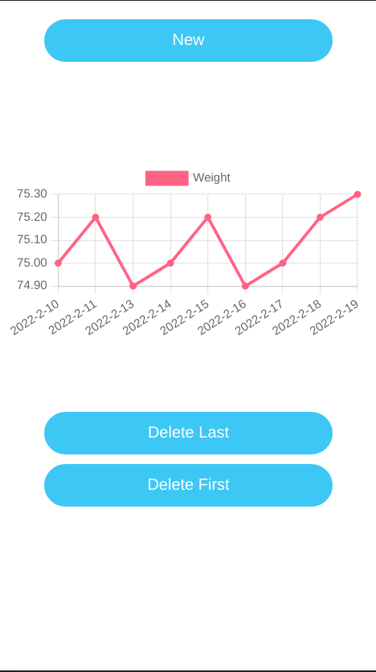

# weight-tracker - PWA

Progressive Web Application that works `offline` and can be installed on any device with a browser.

The app stores the user’s weight data in `local Storage` and uses `Chart.js` to plot the data on a graph to show a trend in weight gain or loss.

